# 📊 PharmInsight v2.0 — 프로젝트 종합 보고서

> **작성일**: 2026-02-23  
> **프로젝트 상태**: 프론트엔드 프로토타입 완성 (API 연동 미구현, 전체 더미 데이터 구동)  
> **버전**: v2.0

---

## 1. 프로젝트 개요

**PharmInsight**는 약국 체인 POS 데이터를 분석하는 **멀티 테넌트 SaaS 플랫폼**의 프론트엔드 프로토타입입니다.  
플랫폼 관리자부터 매장 직원까지 **6단계 역할 기반 접근 제어(RBAC)**를 지원하며, POS 실적·정산서·카드승인·대시보드·지도 인사이트 등 다양한 분석 뷰를 제공합니다.

```mermaid
mindmap
  root((PharmInsight v2.0))
    🏗️ 아키텍처
      멀티 테넌시
      RBAC 6역할
      SPA + CSR
    📊 분석 기능
      POS 실적 통합
      CR정산서
      카드승인 조회
      플랫폼 대시보드
    🗺️ 시각화
      recharts 차트
      MapLibre 지도
      KPI 카드
    🔐 인증/권한
      이중 로그인
      권한 그룹 관리
      테넌트 관리
```

---

## 2. 기술 스택 분석

### 2.1 핵심 기술 스택

```mermaid
graph LR
    subgraph "빌드 & 런타임"
        A[Rsbuild v1.7] --> B[React 19]
        B --> C[TypeScript 5]
        A --> D[Bun 패키지 매니저]
    end

    subgraph "스타일링"
        E[Tailwind CSS 4]
        F[PostCSS]
        E --> F
    end

    subgraph "상태 & 라우팅"
        G[Zustand 5 + persist]
        H[react-router-dom 7]
    end

    subgraph "데이터 시각화"
        I[recharts 3]
        J[MapLibre GL]
        K[react-map-gl 8]
        J --> K
    end

    subgraph "UI & 도구"
        L[lucide-react 0.575]
        M[react-hook-form 7]
        N[Storybook 10]
    end

    style A fill:#4f46e5,color:#fff
    style B fill:#61dafb,color:#000
    style C fill:#3178c6,color:#fff
    style E fill:#06b6d4,color:#fff
    style G fill:#f59e0b,color:#000
    style I fill:#8884d8,color:#fff
    style J fill:#4264fb,color:#fff
```

### 2.2 의존성 구성 비율

| 구분 | 패키지 수 | 비고 |
|:---:|:---:|:---|
| **Production** | 7개 | React, Zustand, recharts, MapLibre, lucide, react-hook-form, react-router-dom |
| **Development** | 18개 | Rsbuild, TypeScript, Tailwind, Biome, ESLint, Storybook, Testing Library 등 |

```mermaid
pie title 의존성 구분 (패키지 수)
    "Production 의존성" : 7
    "Development 의존성" : 18
```

### 2.3 빌드 시스템 특이사항

| 항목 | 선택 | 비고 |
|:---|:---|:---|
| 번들러 | **Rsbuild** (Rspack 기반) | Vite/Webpack이 아닌 Rust 기반 번들러 |
| 패키지 매니저 | **Bun** | npm/yarn/pnpm 대신 사용 |
| CSS 엔진 | **Tailwind CSS 4** | `@import 'tailwindcss'` 방식, 설정 파일 불필요 |
| 린터 | **Biome** + ESLint | Biome가 주 린터, ESLint 보조 |
| 테스트 | **rstest** + Testing Library | Rust 기반 테스트 러너 |

---

## 3. 프로젝트 구조

### 3.1 디렉토리 트리


### 3.2 소스 파일 통계

| 확장자 | 파일 수 | 설명 |
|:---:|:---:|:---|
| `.tsx` | **49** | React 컴포넌트 + Storybook 스토리 |
| `.ts` | **16** | 유틸리티, 타입, 스토어, 데이터 |
| `.css` | **1** | 전역 스타일 (`App.css`) |
| **합계** | **66** | — |

```mermaid
pie title 소스 파일 구성 비율
    "TSX 컴포넌트 (.tsx)" : 49
    "TypeScript (.ts)" : 16
    "CSS (.css)" : 1
```

### 3.3 컴포넌트 분류

```mermaid
graph LR
    subgraph "레이아웃 (6)"
        L1[AppLayout]
        L2[Sidebar]
        L3[TopHeader]
        L4[FilterBar]
        L5[FooterBar]
        L6[PageContainer]
    end

    subgraph "UI 컴포넌트 (8 + 8 Stories)"
        U1[Button]
        U2[Badge]
        U3[KpiCard]
        U4["Table&lt;T&gt;"]
        U5[Pagination]
        U6[Modal]
        U7[DateRangePicker]
        U8[MultiSelect]
    end

    subgraph "차트 (4 + 4 Stories)"
        C1[TrendLineChart]
        C2[PaymentDonutChart]
        C3[PaymentStackBarChart]
        C4[FranchiseRankBarChart]
    end

    subgraph "지도 (1)"
        M1[StoreMap]
    end

    style L1 fill:#1e40af,color:#fff
    style U1 fill:#059669,color:#fff
    style C1 fill:#7c3aed,color:#fff
    style M1 fill:#dc2626,color:#fff
```

---

## 4. 멀티 테넌시 & RBAC 구조

### 4.1 테넌트 계층 구조

```mermaid
graph TD
    P["🏢 Platform<br><i>플랫폼</i>"]
    F1["🏪 Franchise A<br><i>○○약국 체인</i>"]
    F2["🏪 Franchise B<br><i>△△약국 체인</i>"]
    R1["📍 Region 1<br><i>강남지역</i>"]
    R2["📍 Region 2<br><i>강북지역</i>"]
    R3["📍 Region 3<br><i>서초지역</i>"]
    S1["💊 Store 1<br><i>강남점</i>"]
    S2["💊 Store 2<br><i>역삼점</i>"]
    S3["💊 Store 3<br><i>종로점</i>"]
    S4["💊 Store 4<br><i>방배점</i>"]

    P --> F1
    P --> F2
    F1 --> R1
    F1 --> R2
    F2 --> R3
    R1 --> S1
    R1 --> S2
    R2 --> S3
    R3 --> S4

    style P fill:#dc2626,color:#fff
    style F1 fill:#ea580c,color:#fff
    style F2 fill:#ea580c,color:#fff
    style R1 fill:#2563eb,color:#fff
    style R2 fill:#2563eb,color:#fff
    style R3 fill:#2563eb,color:#fff
    style S1 fill:#16a34a,color:#fff
    style S2 fill:#16a34a,color:#fff
    style S3 fill:#16a34a,color:#fff
    style S4 fill:#16a34a,color:#fff
```

### 4.2 역할별 권한 매트릭스

| 역할 | POS 조회 | 정산서 | 카드승인 | 엑셀 | 사용자관리 | 테넌트관리 | 대시보드 | 가맹점관리 |
|:---|:---:|:---:|:---:|:---:|:---:|:---:|:---:|:---:|
| **PLATFORM_ADMIN** | ✅ | ✅ | ✅ | ✅ | ✅ | ✅ | ✅ | ✅ |
| **FRANCHISE_ADMIN** | ✅ | ✅ | ✅ | ✅ | ✅ | ❌ | ❌ | ✅ |
| **FRANCHISE_VIEWER** | ✅ | ✅ | ✅ | ❌ | ❌ | ❌ | ❌ | ❌ |
| **REGION_MANAGER** | ✅ | ✅ | ✅ | ✅ | ❌ | ❌ | ❌ | ❌ |
| **STORE_MANAGER** | ✅ | ✅ | ✅ | ✅ | ❌ | ❌ | ❌ | ❌ |
| **STORE_STAFF** | ✅ | ❌ | ❌ | ❌ | ❌ | ❌ | ❌ | ❌ |

```mermaid
graph TD
    subgraph "접근 범위"
        PA["PLATFORM_ADMIN<br>🔴 전체 시스템"]
        FA["FRANCHISE_ADMIN<br>🟠 소속 프랜차이즈 전체"]
        FV["FRANCHISE_VIEWER<br>🟡 소속 프랜차이즈 (읽기)"]
        RM["REGION_MANAGER<br>🔵 소속 지역 매장들"]
        SM["STORE_MANAGER<br>🟢 소속 매장"]
        SS["STORE_STAFF<br>⚪ 소속 매장 (POS만)"]
    end

    PA --> FA
    FA --> FV
    FA --> RM
    RM --> SM
    SM --> SS

    style PA fill:#dc2626,color:#fff
    style FA fill:#ea580c,color:#fff
    style FV fill:#eab308,color:#000
    style RM fill:#2563eb,color:#fff
    style SM fill:#16a34a,color:#fff
    style SS fill:#6b7280,color:#fff
```

---

## 5. 라우팅 & 네비게이션

### 5.1 전체 라우트 맵

```mermaid
flowchart TD
    ROOT["/ (루트)"] --> PRIV{"PrivateRoute<br>인증 확인"}

    PRIV -->|미인증 + /platform/*| PL["/platform/login<br>PlatformLoginPage"]
    PRIV -->|미인증 + 기타| LG["/login<br>LoginPage"]
    PRIV -->|인증됨| AL["AppLayout<br>(Sidebar + TopHeader + FilterBar)"]

    AL --> IDX["/ → Redirect → /pos/statistics"]
    AL --> PS["/pos/statistics<br>POS 실적 통합"]
    AL --> PI["/pos/items/:itemCode<br>단품 실적 상세"]
    AL --> ST["/settlement<br>CR정산서"]
    AL --> CA["/card/approvals<br>카드승인 조회"]

    AL --> PD["/platform/dashboard<br>플랫폼 대시보드"]
    AL --> PM["/platform/insight-map<br>인사이트 맵"]
    AL --> SY["/platform/system-monitor<br>시스템 모니터"]
    AL --> TN["/platform/tenants<br>테넌트 관리"]
    AL --> US["/platform/users<br>사용자 관리"]
    AL --> PG["/platform/permission-groups<br>권한 그룹"]

    AL --> FS["/franchise/stores<br>가맹점 관리"]

    ST -.->|RoleGuard| RG1["SETTLEMENT_READ"]
    CA -.->|RoleGuard| RG2["CARD_APPROVAL_READ"]
    PD -.->|RoleGuard| RG3["PLATFORM_DASHBOARD"]
    PM -.->|RoleGuard| RG3
    SY -.->|RoleGuard| RG3
    TN -.->|RoleGuard| RG4["TENANT_MANAGE"]
    US -.->|RoleGuard| RG5["USER_MANAGE"]
    PG -.->|RoleGuard| RG4
    FS -.->|RoleGuard| RG6["FRANCHISE_STORE_MANAGE"]

    style ROOT fill:#1e293b,color:#fff
    style AL fill:#3b82f6,color:#fff
    style PL fill:#7c3aed,color:#fff
    style LG fill:#7c3aed,color:#fff
    style RG1 fill:#f59e0b,color:#000
    style RG2 fill:#f59e0b,color:#000
    style RG3 fill:#f59e0b,color:#000
    style RG4 fill:#f59e0b,color:#000
    style RG5 fill:#f59e0b,color:#000
    style RG6 fill:#f59e0b,color:#000
```

### 5.2 페이지 분류

| 영역 | 페이지 수 | 페이지 목록 |
|:---|:---:|:---|
| **인증** | 2 | LoginPage, PlatformLoginPage |
| **POS 분석** | 2 | PosStatisticsPage, ItemDetailPage |
| **정산/카드** | 2 | SettlementPage, CardApprovalPage |
| **플랫폼 관리** | 7 | Dashboard, InsightMap, SystemMonitor, TenantManage, TenantPermissionModal, UserManage, PermissionGroup |
| **프랜차이즈** | 1 | StoreManagePage |
| **합계** | **14** | — |

```mermaid
pie title 영역별 페이지 수
    "플랫폼 관리" : 7
    "POS 분석" : 2
    "인증" : 2
    "정산/카드" : 2
    "프랜차이즈" : 1
```

---

## 6. 인증 & 상태 관리 플로우

### 6.1 이중 로그인 시스템

```mermaid
sequenceDiagram
    participant U as 사용자
    participant LP as /login (LoginPage)
    participant PLP as /platform/login (PlatformLoginPage)
    participant ZS as Zustand Store (persist)
    participant LS as localStorage

    Note over LP,PLP: 로그인 진입점 분리

    rect rgb(239, 246, 255)
        Note right of U: 테넌트 사용자 플로우
        U->>LP: ID/PW 입력
        LP->>LP: PLATFORM_ADMIN이면 거부
        LP->>ZS: login(user)
        ZS->>LS: persist (pharminsight-auth)
        LP->>U: Redirect → /pos/statistics
    end

    rect rgb(254, 243, 199)
        Note right of U: 플랫폼 관리자 플로우
        U->>PLP: ID/PW 입력
        PLP->>PLP: PLATFORM_ADMIN만 허용
        PLP->>ZS: login(user)
        ZS->>LS: persist (pharminsight-auth)
        PLP->>U: Redirect → /platform/dashboard
    end
```

### 6.2 Zustand 상태 구조


---

## 7. 데이터 레이어 (더미 데이터)

### 7.1 더미 데이터 파일 구성

```mermaid
graph LR
    subgraph "src/data/ — 더미 데이터 (API 연동 시 교체)"
        BD["branding.dummy.ts<br><i>서비스 브랜딩</i>"]
        AD["auth.dummy.ts<br><i>6개 테스트 계정</i>"]
        PD["pos.dummy.ts<br><i>POS 실적 + 트렌드 + 단품 100개</i>"]
        SD["settlement.dummy.ts<br><i>결제수단 4종 + 30일 추이</i>"]
        CD["card.dummy.ts<br><i>카드사 6종 + 승인 200건</i>"]
        PLD["platform.dummy.ts<br><i>KPI + 프랜차이즈 12개 + 사용자 26명 + 매장</i>"]
        PMD["permission.dummy.ts<br><i>메뉴 7개 + 그룹 4개</i>"]
    end

    subgraph "소비 페이지"
        P1[LoginPage]
        P2[PosStatisticsPage]
        P3[SettlementPage]
        P4[CardApprovalPage]
        P5[PlatformDashboardPage]
        P6[TenantManagePage]
        P7[PermissionGroupPage]
    end

    BD --> P1
    AD --> P1
    PD --> P2
    SD --> P3
    CD --> P4
    PLD --> P5
    PLD --> P6
    PMD --> P7

    style BD fill:#f59e0b,color:#000
    style AD fill:#f59e0b,color:#000
    style PD fill:#f59e0b,color:#000
    style SD fill:#f59e0b,color:#000
    style CD fill:#f59e0b,color:#000
    style PLD fill:#f59e0b,color:#000
    style PMD fill:#f59e0b,color:#000
```

### 7.2 API 전환 매핑

| 더미 데이터 파일 | 대체 API 엔드포인트 | 데이터 규모 |
|:---|:---|:---|
| `branding.dummy.ts` | `GET /api/platform/branding` | 설정 1건 |
| `auth.dummy.ts` | `POST /api/auth/login` | 계정 6개 |
| `pos.dummy.ts` | `GET /api/pos/statistics, /items` | 단품 100건 |
| `settlement.dummy.ts` | `GET /api/settlement` | 30일 × 4수단 |
| `card.dummy.ts` | `GET /api/card/approvals` | 승인 200건 |
| `platform.dummy.ts` | `GET /api/platform/dashboard, /franchises, /users` | 프랜차이즈 12, 사용자 26, 매장 N |
| `permission.dummy.ts` | `GET/POST/PUT/DELETE /api/permission/groups` | 메뉴 7, 그룹 4 |

> [!TIP]
> `paginateArray<T>()` 유틸리티가 Spring Page 응답 형식과 동일하게 설계되어 있어, API 교체 시 `Pagination` 컴포넌트는 수정 없이 그대로 사용 가능합니다.

---

## 8. UI 컴포넌트 시스템

### 8.1 레이아웃 아키텍처


### 8.2 디자인 토큰

| 토큰 | 값 | 용도 |
|:---|:---|:---|
| 배경 | `bg-slate-50` | 메인 영역 배경 |
| 카드 | `bg-white rounded-lg border border-gray-100 shadow-sm` | 모든 카드/패널 |
| 사이드바 | `bg-slate-900` | 네비게이션 |
| 주요 액션 | `bg-blue-600` | 버튼, 로고 |
| 성장(+) | `text-emerald-500` | KPI 상승 지표 |
| 감소(−) | `text-red-400` | KPI 하락 지표 |
| 최대 너비 | `max-w-[1280px]` | 레이아웃 제약 |

### 8.3 Storybook 커버리지


| 카테고리 | 스토리 수 | 컴포넌트 수 | 커버리지 |
|:---|:---:|:---:|:---:|
| UI 컴포넌트 | 8 | 8 | **100%** |
| 차트 컴포넌트 | 4 | 4 | **100%** |
| 레이아웃 | 0 | 6 | 0% |
| 지도 | 0 | 1 | 0% |
| 페이지 | 0 | 14 | 0% |

---

## 9. 차트 & 데이터 시각화

### 9.1 차트 컴포넌트 구성

```mermaid
graph TD
    subgraph "recharts 기반 차트"
        TC["TrendLineChart<br>ComposedChart<br>Bar(매출) + Line(비교)"]
        DC["PaymentDonutChart<br>PieChart<br>innerRadius=70, outerRadius=105"]
        SC["PaymentStackBarChart<br>BarChart<br>stackId=payment"]
        FC["FranchiseRankBarChart<br>BarChart<br>프랜차이즈 랭킹"]
    end

    subgraph "공통 인프라"
        CT["ChartTooltip<br>TOOLTIP_PROPS 공용 상수"]
        CC["chartColors.ts<br>PAYMENT_COLORS<br>FRANCHISE_RANK_COLORS"]
        RC["ResponsiveContainer<br>width=100% 필수"]
    end

    CT --> TC
    CT --> DC
    CT --> SC
    CT --> FC
    CC --> DC
    CC --> SC
    CC --> FC
    RC --> TC
    RC --> DC
    RC --> SC
    RC --> FC

    style TC fill:#8b5cf6,color:#fff
    style DC fill:#ec4899,color:#fff
    style SC fill:#06b6d4,color:#fff
    style FC fill:#f59e0b,color:#000
    style CT fill:#6b7280,color:#fff
    style CC fill:#6b7280,color:#fff
```

### 9.2 사용 Page ↔ Chart 매핑

| 차트 | 사용 페이지 | 데이터 소스 |
|:---|:---|:---|
| `TrendLineChart` | PosStatisticsPage | `DUMMY_TREND_*` (시간/일/요일/기간) |
| `PaymentDonutChart` | SettlementPage | `DUMMY_SETTLEMENT.breakdown` |
| `PaymentStackBarChart` | SettlementPage | `DUMMY_SETTLEMENT.dailyTrend` |
| `FranchiseRankBarChart` | PlatformDashboardPage | `DUMMY_FRANCHISES` |

---

## 10. 주요 페이지 기능 상세

### 10.1 기능 복잡도 맵

```mermaid
quadrantChart
    title 페이지별 기능 복잡도 vs 사용 빈도
    x-axis "낮은 복잡도" --> "높은 복잡도"
    y-axis "낮은 사용 빈도" --> "높은 사용 빈도"
    POS실적: [0.65, 0.90]
    단품상세: [0.35, 0.55]
    CR정산서: [0.50, 0.70]
    카드승인: [0.55, 0.65]
    대시보드: [0.60, 0.50]
    인사이트맵: [0.70, 0.35]
    시스템모니터: [0.40, 0.25]
    테넌트관리: [0.80, 0.30]
    사용자관리: [0.75, 0.35]
    권한그룹: [0.85, 0.20]
```

### 10.2 페이지별 주요 기능 요약

| 페이지 | 핵심 기능 | 코드 크기 | 주요 컴포넌트 사용 |
|:---|:---|:---:|:---|
| **PosStatisticsPage** | 매장 선택기, 축 전환, 카테고리 필터, 페이지네이션 | 보통 | KpiCard, TrendLineChart, Table, Pagination |
| **ItemDetailPage** | 동적 라우트 파라미터, 단품 상세 정보 | 소 | KpiCard |
| **SettlementPage** | 결제수단 필터, daily/period 모드 전환 | 보통 | PaymentDonutChart, PaymentStackBarChart, KpiCard |
| **CardApprovalPage** | 카드사+상태+날짜+매장 복합 필터, 상태별 행 색상 | 보통 | Table, Pagination |
| **PlatformDashboardPage** | 이상징후 알림, KPI 차트, 프랜차이즈 랭킹 | 큼 | KpiCard, FranchiseRankBarChart, TrendLineChart |
| **PlatformInsightMapPage** | 전국 가맹점 분포 지도, fitBounds | 보통 | StoreMap |
| **SystemMonitorPage** | 서버/DB 상태 모니터링 대시보드 | 보통 | 커스텀 카드 |
| **TenantManagePage** | CRUD 모달 (react-hook-form), 상태 토글 | **큼** (18KB) | Table, Modal, Button |
| **UserManagePage** | 초대/역할 수정, 프랜차이즈별 필터 | **큼** (16KB) | Table, Modal, MultiSelect |
| **PermissionGroupPage** | 권한 그룹 CRUD, 계층형 메뉴 체크박스 | **큼** (16KB) | Table, Modal, Button |
| **StoreManagePage** | 지도+리스트 동기화, 가맹점 관리 | 보통 | StoreMap, Table |
| **TenantPermissionModal** | 테넌트별 권한 그룹 배정 + 메뉴 예외 설정 | 큼 (13KB) | Modal |

---

## 11. 개발 환경 & 도구

### 11.1 사용 가능한 명령어

```mermaid
graph LR
    subgraph "개발"
        DEV["bun run dev<br>개발 서버 + 자동 열기"]
        SB["bun run storybook<br>컴포넌트 카탈로그<br>port 6006"]
    end

    subgraph "품질 관리"
        CHECK["bun run check<br>Biome lint + format"]
        LINT["bun run lint<br>ESLint"]
        FORMAT["bun run format<br>Prettier"]
        TEST["bun run test<br>rstest"]
    end

    subgraph "빌드"
        BUILD["bun run build<br>프로덕션 → dist/"]
        PREVIEW["bun run preview<br>빌드 미리보기"]
        BSB["bun run build-storybook<br>정적 Storybook"]
    end

    style DEV fill:#16a34a,color:#fff
    style SB fill:#ff4785,color:#fff
    style BUILD fill:#2563eb,color:#fff
```

### 11.2 TypeScript 엄격 모드

| 옵션 | 값 | 영향 |
|:---|:---:|:---|
| `strict` | ✅ | 전체 strict 모드 |
| `noUnusedLocals` | ✅ | 미사용 변수 → 빌드 에러 |
| `noUnusedParameters` | ✅ | 미사용 파라미터 → 빌드 에러 |

---

## 12. 아키텍처 다이어그램 — 전체 요약

```mermaid
C4Context
    title PharmInsight v2.0 시스템 아키텍처

    Person(tenantUser, "테넌트 사용자", "프랜차이즈/지역/매장")
    Person(platformAdmin, "플랫폼 관리자", "전체 시스템 관리")

    System_Boundary(frontend, "프론트엔드 (SPA)") {
        Container(router, "React Router v7", "SPA 라우팅 + Guard")
        Container(pages, "14개 페이지", "비즈니스 로직")
        Container(components, "32개 컴포넌트", "UI + 차트 + 지도 + 레이아웃")
        Container(store, "Zustand Store", "인증 상태 + localStorage persist")
        Container(dummy, "더미 데이터 7파일", "API 교체 대상")
    }

    System_Ext(api, "백엔드 API (미구현)", "Spring Boot 예정")
    System_Ext(map, "CartoDB 타일서버", "MapLibre 배경 지도")

    Rel(tenantUser, router, "/login 경유")
    Rel(platformAdmin, router, "/platform/login 경유")
    Rel(router, pages, "라우트 매칭 + RoleGuard")
    Rel(pages, components, "UI 렌더링")
    Rel(pages, dummy, "더미 데이터 import")
    Rel(pages, store, "인증 상태 조회")
    Rel(components, map, "지도 타일 요청")
    Rel(dummy, api, "향후 교체 예정", "REST API")
```

---

## 13. 프로젝트 현황 & 로드맵

### 13.1 완료 현황

```mermaid
pie title 개발 완료 현황
    "✅ UI 컴포넌트" : 100
    "✅ 차트 시스템" : 100
    "✅ 라우팅/인증" : 100
    "✅ 페이지 구현" : 100
    "✅ 더미 데이터" : 100
    "✅ Storybook" : 75
    "⬜ API 연동" : 0
    "⬜ 테스트 커버리지" : 5
```

### 13.2 현재 상태 (프로토타입 완성)

| 영역 | 상태 | 비고 |
|:---|:---:|:---|
| 페이지 UI 구현 | ✅ 완료 | 14개 전체 페이지 구현 |
| RBAC 시스템 | ✅ 완료 | 6역할, 8권한 체계 구축 |
| 차트 시각화 | ✅ 완료 | recharts 기반 4종 차트 |
| 지도 연동 | ✅ 완료 | MapLibre + CartoDB 타일 |
| Storybook | 🟡 부분 | UI/차트 100%, 레이아웃/페이지 미구현 |
| 테넌트 권한 관리 | ✅ 완료 | 그룹 기반 + 메뉴 예외 설정 |
| API 연동 | ❌ 미착수 | 더미 데이터 → REST API 전환 필요 |
| 자동화 테스트 | ❌ 미착수 | 기본 설정만 존재 (rstest + Testing Library) |
| 프로덕션 배포 | ❌ 미착수 | CI/CD, 도커 설정 필요 |

### 13.3 향후 개발 로드맵

```mermaid
gantt
    title 향후 개발 로드맵 (예상)
    dateFormat YYYY-MM
    axisFormat %Y-%m

    section 백엔드
        Spring Boot API 개발         :active, be1, 2026-03, 3M
        데이터베이스 설계/구축         :be2, 2026-03, 2M

    section 프론트엔드
        API 연동 (더미 데이터 교체)    :fe1, after be1, 2M
        단위/통합 테스트 작성          :fe2, 2026-04, 2M
        E2E 테스트                    :fe3, after fe1, 1M

    section 인프라
        CI/CD 파이프라인              :inf1, 2026-05, 1M
        프로덕션 배포                  :inf2, after inf1, 1M

    section 기능 확장
        실시간 알림 시스템             :ex1, after fe1, 2M
        리포트 자동 생성               :ex2, after ex1, 1M
```

---

## 14. 주요 설계 결정 & 주의사항

### 14.1 아키텍처 결정 사항

| # | 결정 | 이유 |
|:---:|:---|:---|
| 1 | **Rsbuild** 선택 (Vite 대신) | Rspack 기반 Rust 번들러, 더 빠른 빌드 성능 |
| 2 | **Zustand + persist** | 가벼운 상태 관리, localStorage 영속화로 새로고침 대응 |
| 3 | **이중 로그인 분리** | 보안상 플랫폼 관리자와 테넌트 사용자 진입점 완전 분리 |
| 4 | **PageMeta Context 분리** | `SettersContext` / `ValuesContext` 분리로 무한 루프 방지 |
| 5 | **이모지 사용 금지** | 플랫폼간 렌더링 불일치, lucide SVG 아이콘으로 통일 |
| 6 | **chartColors.ts 중앙 관리** | 차트 색상 일관성 보장, 로컬 색상 정의 금지 |
| 7 | **CSS overlay 도넛 중심텍스트** | recharts `<Label>` viewBox.cx/cy 미보장 이슈 회피 |
| 8 | **Spring Page 호환 페이지네이션** | `paginateArray()` 0-based, API 교체 시 수정 불필요 |

### 14.2 개발 시 주의사항

> [!WARNING]
> - `??`와 `||` 혼용 시 괄호 필수 (SWC 파싱 오류)
> - `source.alias` 사용 금지 (rsbuild deprecated) → `resolve.alias` 사용
> - recharts 차트는 반드시 `ResponsiveContainer width="100%"`로 래핑
> - Storybook ESM 환경에서 `__dirname` 사용 불가 → `fileURLToPath` 사용

---

## 15. 더미 계정 정보 (테스트용)

| 계정 ID | 역할 | 소속 | 비밀번호 |
|:---|:---|:---|:---:|
| USER-001 | PLATFORM_ADMIN | 전체 | `test1234` |
| USER-002 | FRANCHISE_ADMIN | FRAN-001 | `test1234` |
| USER-003 | FRANCHISE_VIEWER | FRAN-001 | `test1234` |
| USER-004 | REGION_MANAGER | REGION-01 | `test1234` |
| USER-005 | STORE_MANAGER | STORE-001 (강남점) | `test1234` |
| USER-006 | STORE_STAFF | STORE-001 (강남점) | `test1234` |

---

> **보고서 끝** | PharmInsight v2.0 프론트엔드 프로토타입 종합 보고서
